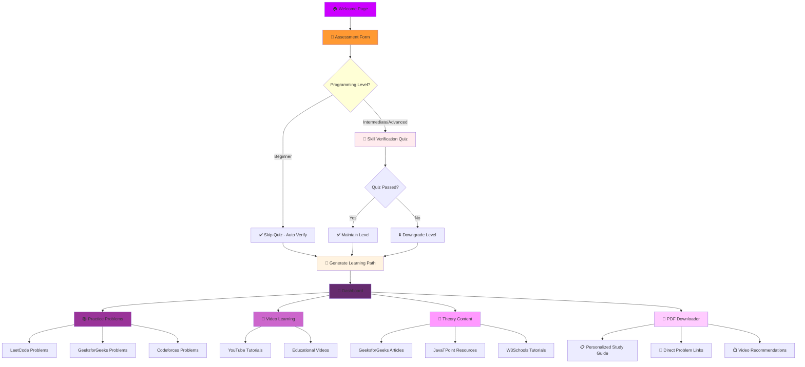

# 🧠 DSA Learning Pathway Application

An intelligent, personalized Data Structures and Algorithms (DSA) learning platform that creates customized learning paths based on user assessment and skill verification. This application helps students and professionals master DSA concepts through adaptive learning, curated practice problems, and comprehensive study materials.

## 📊 Application Flow Diagram



## 🚀 What This Application Does

### 🎯 Core Functionality

#### 1. **Intelligent Assessment System**
- **Initial Evaluation**: Comprehensive questionnaire to assess current programming knowledge
- **Skill Level Detection**: Automatically categorizes users into Beginner, Intermediate, or Advanced levels
- **Goal-Based Customization**: Tailors learning paths based on career objectives (Job Preparation, Academic Excellence, Competitive Programming)
- **Time Management**: Adjusts schedule based on available daily study hours

#### 2. **Adaptive Skill Verification**
- **Smart Quiz System**: For intermediate/advanced users to validate their claimed skill level
- **Level Adjustment**: Automatically downgrades level if verification fails to ensure appropriate content
- **Beginner-Friendly**: Skips verification for beginners to reduce intimidation
- **Score Tracking**: Maintains quiz scores for progress monitoring

#### 3. **Personalized Learning Path Generation**
- **AI-Driven Curriculum**: Creates custom learning schedules based on assessment results
- **Adaptive Duration**: Adjusts timeline based on daily time commitment
- **Topic Progression**: Follows a logical sequence from fundamentals to advanced concepts
- **Daily Planning**: Provides structured day-by-day learning schedule

#### 4. **Comprehensive Resource Integration**

##### 📚 Practice Problems
- **Multi-Platform Curation**: Problems from LeetCode, GeeksforGeeks, Codeforces, HackerRank
- **Difficulty Progression**: Structured Easy → Medium → Hard advancement
- **Topic-Wise Organization**: Problems categorized by DSA concepts
- **Direct Links**: One-click access to original problem statements

##### 🎥 Video Learning
- **Expert Instructors**: Curated content from top educators (Striver, Abdul Bari, Apna College)
- **Concept Alignment**: Videos synchronized with daily learning topics
- **Quality Assurance**: Hand-picked tutorials for maximum learning efficiency
- **YouTube Integration**: Direct access to educational content

##### 📖 Theory Content
- **Trusted Sources**: Articles from GeeksforGeeks, JavaTPoint, W3Schools
- **Comprehensive Coverage**: In-depth explanations of all DSA concepts
- **Reading Time Estimates**: Helps with time management
- **External Links**: Direct access to source materials

##### 📄 PDF Generation
- **Offline Learning**: Downloadable study guides for internet-free studying
- **Personalized Content**: Custom PDFs based on individual learning paths
- **Complete Resource List**: Includes all links, videos, and practice problems
- **Progress Tracking**: Built-in checklists for monitoring advancement

## 🛠️ Technical Architecture

### Frontend Stack
- **React 18**: Modern component-based UI framework
- **TypeScript**: Type-safe development for better code quality
- **Tailwind CSS**: Utility-first styling for responsive design
- **Vite**: Fast build tool for optimal development experience
- **Lucide React**: Consistent icon library

### Key Components

#### 🏠 WelcomePage.tsx
- Landing page with feature highlights
- Animated UI elements for engagement
- Clear call-to-action for user onboarding

#### 📝 AssessmentForm.tsx
- Multi-step form for comprehensive user evaluation
- Validates input and provides helpful guidance
- Collects data on experience, goals, and time availability

#### 🧪 SkillVerificationQuiz.tsx
- Adaptive quiz system for intermediate/advanced users
- Real-time scoring and feedback
- Level adjustment based on performance

#### 📱 Dashboard.tsx
- Central hub displaying personalized learning path
- Feature navigation with beautiful card-based design
- Progress overview and profile summary

#### 📚 PracticeProblems.tsx
- Curated problem collections from multiple platforms
- Filtering and searching capabilities
- Difficulty-based organization

#### 🎥 VideoLearning.tsx
- Organized video tutorials by topic
- Duration estimates and quality ratings
- Direct YouTube integration

#### 📖 TheoryContent.tsx
- Comprehensive article library
- Source credibility indicators
- Reading time management

#### 📄 PDFDownloader.tsx
- Dynamic PDF generation based on user data
- Customization options for content inclusion
- Download progress tracking

### Data Management

#### types/index.ts
- Comprehensive TypeScript interfaces
- Type safety for all data structures
- Clear API contracts

#### data/learningPaths.ts
- Algorithm for generating personalized paths
- Level-specific curriculum content
- Duration adjustment logic

## 🎯 Learning Path Examples

### 🟢 Beginner Path (12-16 weeks)
1. Programming Fundamentals
2. Basic Arrays & Strings
3. Simple Searching & Sorting
4. Introduction to Complexity
5. Basic Recursion
6. Stacks & Queues
7. Linked Lists
8. Basic Trees
9. Hash Tables
10. Graph Basics

### 🟡 Intermediate Path (16-20 weeks)
1. Advanced Arrays & 2D Arrays
2. String Algorithms
3. Sorting & Searching Algorithms
4. Recursion & Backtracking
5. Stacks & Queues Applications
6. Tree Traversals & BST
7. Heap & Priority Queues
8. Graph Algorithms (BFS/DFS)
9. Dynamic Programming Basics
10. Greedy Algorithms

### 🔴 Advanced Path (20-24 weeks)
1. Advanced Tree Algorithms
2. Graph Algorithms (Advanced)
3. Dynamic Programming (Advanced)
4. String Matching Algorithms
5. Advanced Data Structures
6. Segment Trees & Fenwick Trees
7. Network Flow Algorithms
8. Computational Geometry
9. Number Theory
10. Advanced Problem Solving

## 🚀 Getting Started

### Prerequisites
- Node.js (v14 or higher)
- npm or yarn package manager

### Installation
```bash
# Clone the repository
git clone <repository-url>
cd dsa-learning-pathway

# Install dependencies
npm install

# Start development server
npm run dev
```

### Usage Flow
1. **Start**: Click "Start Your Journey" on the welcome page
2. **Assess**: Complete the comprehensive assessment form
3. **Verify**: Take the skill verification quiz (if intermediate/advanced)
4. **Learn**: Access your personalized dashboard with curated resources
5. **Practice**: Solve problems, watch videos, read theory, download PDFs
6. **Progress**: Track your advancement through the learning path

## 📁 Project Structure

```
src/
├── components/           # React components
│   ├── WelcomePage.tsx  # Landing page
│   ├── AssessmentForm.tsx # User evaluation
│   ├── SkillVerificationQuiz.tsx # Level verification
│   ├── Dashboard.tsx    # Main navigation hub
│   ├── PracticeProblems.tsx # Coding challenges
│   ├── VideoLearning.tsx # Tutorial videos
│   ├── TheoryContent.tsx # Educational articles
│   └── PDFDownloader.tsx # Study guide generator
├── data/                # Static data and algorithms
│   └── learningPaths.ts # Path generation logic
├── types/               # TypeScript definitions
│   └── index.ts         # Interface definitions
├── App.tsx              # Main application router
└── main.tsx             # Application entry point
```

## 🎯 Key Features

- ✅ **Personalized Learning**: AI-generated paths based on individual assessment
- ✅ **Skill Verification**: Adaptive quizzes to ensure appropriate content level
- ✅ **Multi-Platform Integration**: Resources from top coding platforms
- ✅ **Offline Learning**: Downloadable PDF study guides
- ✅ **Progress Tracking**: Visual indicators and achievement milestones
- ✅ **Responsive Design**: Works seamlessly on desktop and mobile
- ✅ **Expert Content**: Curated by programming education professionals

## 🤝 Contributing

1. Fork the repository
2. Create a feature branch (`git checkout -b feature/amazing-feature`)
3. Commit your changes (`git commit -m 'Add: Amazing feature'`)
4. Push to the branch (`git push origin feature/amazing-feature`)
5. Open a Pull Request

## 📞 Support

- 🐛 **Issues**: Report bugs via GitHub issues
- 💡 **Features**: Request enhancements through discussions
- 📧 **Contact**: For direct support and inquiries

---

**⭐ Star this repository if it helps your DSA learning journey!**
