# MERN Stack Capstone Project

## Overview

This is a comprehensive MERN (MongoDB, Express.js, React, Node.js) stack capstone project designed as an educational platform. It provides a full-featured learning management system with user authentication, skill assessment, video learning modules, practice problems, and personalized learning paths.


## 📊 Application Flow Diagram

```mermaid
graph TD
    A[🏠 Welcome Page] --> B[📝 Assessment Form]
    B --> C{Programming Level?}
    
    C -->|Beginner| D[✅ Skip Quiz - Auto Verify]
    C -->|Intermediate/Advanced| E[🧪 Skill Verification Quiz]
    
    E --> F{Quiz Passed?}
    F -->|Yes| G[✅ Maintain Level]
    F -->|No| H[⬇️ Downgrade Level]
    
    D --> I[🎯 Generate Learning Path]
    G --> I
    H --> I
    
    I --> J[📱 Dashboard]
    
    J --> K[📚 Practice Problems]
    J --> L[🎥 Video Learning]
    J --> M[📖 Theory Content]
    J --> N[📄 PDF Downloader]
    
    K --> O[LeetCode Problems]
    K --> P[GeeksforGeeks Problems]
    K --> Q[Codeforces Problems]
    
    L --> R[YouTube Tutorials]
    L --> S[Educational Videos]
    
    M --> T[GeeksforGeeks Articles]
    M --> U[JavaTPoint Resources]
    M --> V[W3Schools Tutorials]
    
    N --> W[📋 Personalized Study Guide]
    N --> X[🔗 Direct Problem Links]
    N --> Y[📺 Video Recommendations]
    
    style A fill:#b300e6
    style J fill:#b300e6
    style K fill:#b300e6
    style L fill:#b300e6
    style M fill:#b300e6
    style N fill:#b300e6
    style B fill:#b300e6
    style C fill:#b300e6
    style I fill:#b300e6
    style E fill:#b300e6
```




## Features

- **User Authentication**: Secure login/signup with Google OAuth integration
- **Dashboard**: Personalized user dashboard with progress tracking
- **Skill Assessment**: Comprehensive skill verification quizzes
- **Video Learning**: Interactive video-based learning modules
- **Practice Problems**: Coding practice problems with solutions
- **Learning Paths**: Structured learning paths tailored to user needs
- **PDF Download**: Generate and download assessment reports
- **Responsive Design**: Mobile-friendly interface built with Tailwind CSS

## Tech Stack

### Backend
- **Node.js** - Runtime environment
- **Express.js** - Web application framework
- **MongoDB** - NoSQL database
- **Mongoose** - MongoDB object modeling
- **Passport.js** - Authentication middleware
- **JWT** - JSON Web Tokens for session management
- **bcryptjs** - Password hashing

### Frontend
- **React** - UI library
- **TypeScript** - Type-safe JavaScript
- **Vite** - Build tool and development server
- **Tailwind CSS** - Utility-first CSS framework
- **Axios** - HTTP client for API calls

### Development Tools
- **Nodemon** - Automatic server restart
- **ESLint** - Code linting
- **PostCSS** - CSS processing

## Architecture Diagram

```
┌─────────────────┐    ┌─────────────────┐    ┌─────────────────┐
│   Frontend      │    │   Backend       │    │   Database      │
│   (React)       │◄──►│   (Express)     │◄──►│   (MongoDB)     │
│                 │    │                 │    │                 │
│ - Components    │    │ - Routes        │    │ - Users         │
│ - Pages         │    │ - Controllers   │    │ - Questions     │
│ - Services      │    │ - Models        │    │ - Assessments   │
│ - Types         │    │ - Middleware    │    │                 │
└─────────────────┘    └─────────────────┘    └─────────────────┘
         │                       │                       │
         └───────────────────────┼───────────────────────┘
                                 │
                    ┌─────────────────┐
                    │   Deployment    │
                    │                 │
                    │ - Render        │
                    │ - Vercel        │
                    └─────────────────┘
```

## Application Flowchart

```
Start
  │
  ▼
User visits website
  │
  ▼
Authentication Required?
  ├── Yes ──► Google OAuth Login
  │         │
  │         ▼
  │       Dashboard
  │         │
  │         ▼
  │       Select Learning Path
  │         │
  │         ▼
  │       Complete Modules
  │         │
  │         ▼
  │       Take Assessment
  │         │
  │         ▼
  │       Generate Report
  │         │
  │         ▼
  │       Download PDF
  │
  └── No ──► Public Content
            │
            ▼
          Browse Learning Materials
```

## Prerequisites

Before running this project, make sure you have the following installed:

- **Node.js** (version 16 or higher)
- **npm** or **yarn**
- **MongoDB** (local installation or cloud service like MongoDB Atlas)
- **Git**

## Installation

1. **Clone the repository:**
   ```bash
   git clone <repository-url>
   cd MERN_STACK_CAPSTONE_PROJECT
   ```

2. **Backend Setup:**
   ```bash
   cd backend
   npm install
   ```

3. **Frontend Setup:**
   ```bash
   cd ../frontend
   npm install
   ```

## Environment Configuration

### Backend Environment Variables

Create a `.env` file in the `backend` directory:

```env
PORT=5000
MONGODB_URI=mongodb://localhost:27017/mern_capstone
GOOGLE_OAUTH_CLIENT_ID=your_google_client_id
GOOGLE_OAUTH_CLIENT_SECRET=your_google_client_secret
CALLBACK_URL=https://your-render-app.onrender.com/auth/google/callback
FRONTEND_URL=https://your-vercel-app.vercel.app
JWT_SECRET=your_jwt_secret
SESSION_SECRET=your_session_secret
```

### Frontend Environment Variables

Create a `.env` file in the `frontend` directory:

```env
VITE_API_BASE_URL=http://localhost:5000/api
```

## Running Locally

### Backend

1. Start MongoDB service (if running locally)
2. Navigate to backend directory:
   ```bash
   cd backend
   npm run dev
   ```
   The server will start on `http://localhost:5000`

### Frontend

1. Navigate to frontend directory:
   ```bash
   cd frontend
   npm run dev
   ```
   The application will be available at `http://localhost:5173`

### Full Application

Open two terminal windows/tabs:

**Terminal 1 (Backend):**
```bash
cd backend
npm run dev
```

**Terminal 2 (Frontend):**
```bash
cd frontend
npm run dev
```

Visit `http://localhost:5173` in your browser.

## API Endpoints

### Authentication
- `POST /api/auth/google` - Google OAuth login
- `GET /api/auth/logout` - Logout user

### Questions
- `GET /api/questions` - Get all questions
- `POST /api/questions` - Create new question
- `PUT /api/questions/:id` - Update question
- `DELETE /api/questions/:id` - Delete question

### User
- `GET /api/user/profile` - Get user profile
- `PUT /api/user/profile` - Update user profile

## Deployment

### Backend Deployment on Render

1. **Create a Render Account:**
   - Go to [render.com](https://render.com) and sign up

2. **Connect Repository:**
   - Connect your GitHub repository

3. **Create Web Service:**
   - Click "New" → "Web Service"
   - Select your repository
   - Configure build settings:
     - **Build Command:** `npm install`
     - **Start Command:** `npm start`
   - Add environment variables in Render dashboard

4. **Database Setup:**
   - Use MongoDB Atlas for production database
   - Update `MONGODB_URI` in environment variables

5. **Google OAuth Setup:**
   - Update the redirect URI in Google Cloud Console to: `https://your-render-app.onrender.com/auth/google/callback`
   - Set `CALLBACK_URL` environment variable to the same URL

6. **Deploy:**
   - Render will automatically deploy on git push

### Frontend Deployment on Vercel

1. **Create a Vercel Account:**
   - Go to [vercel.com](https://vercel.com) and sign up

2. **Connect Repository:**
   - Connect your GitHub repository

3. **Deploy Frontend:**
   - Click "New Project"
   - Select your repository
   - Configure build settings:
     - **Framework Preset:** Vite
     - **Root Directory:** `frontend`
     - **Build Command:** `npm run build`
     - **Output Directory:** `dist`
   - Add environment variables:
     - `VITE_API_BASE_URL` - `https://mern-stack-capstone-project.onrender.com`

4. **Update API Calls:**
   - Ensure frontend API calls point to production backend URL

5. **Deploy:**
   - Vercel will deploy automatically on git push

## Project Structure

```
MERN_STACK_CAPSTONE_PROJECT/
├── backend/
│   ├── config/
│   │   └── passport.js
│   ├── models/
│   │   └── User.js
│   ├── routes/
│   │   ├── auth.js
│   │   └── questions.js
│   ├── server.js
│   ├── package.json
│   └── .env
├── frontend/
│   ├── src/
│   │   ├── components/
│   │   ├── pages/
│   │   ├── services/
│   │   ├── types/
│   │   └── main.tsx
│   ├── package.json
│   ├── vite.config.ts
│   └── index.html
├── .gitignore
└── README.md
```

## Contributing

1. Fork the repository
2. Create a feature branch (`git checkout -b feature/AmazingFeature`)
3. Commit your changes (`git commit -m 'Add some AmazingFeature'`)
4. Push to the branch (`git push origin feature/AmazingFeature`)
5. Open a Pull Request

## License

This project is licensed under the MIT License - see the [LICENSE](LICENSE) file for details.

## Support

For support, email support@example.com or join our Discord channel.

## Acknowledgments

- React documentation
- Express.js guides
- MongoDB documentation
- Tailwind CSS documentation
